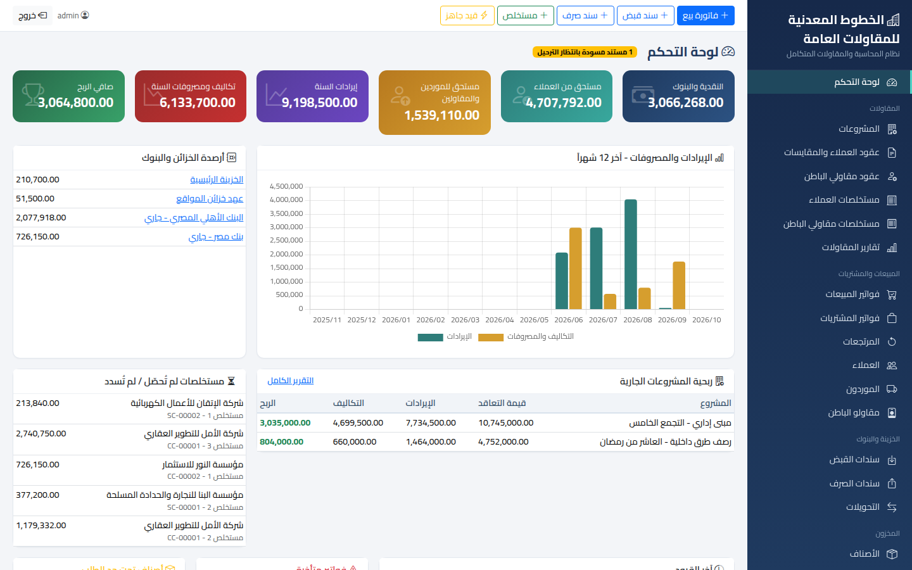
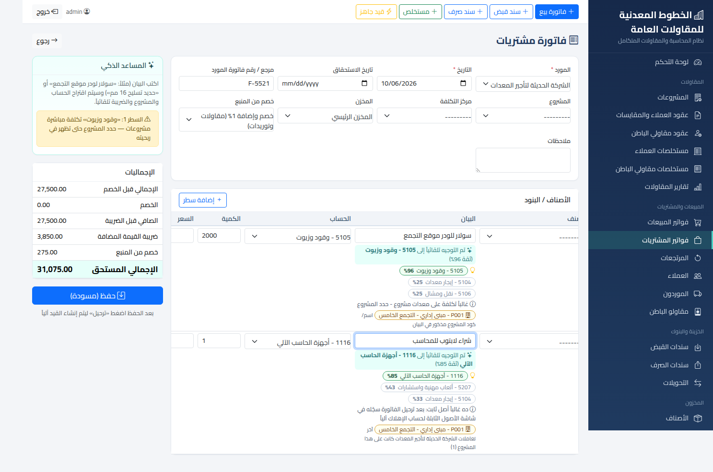

# نظام المحاسبة والمقاولات المتكامل — الخطوط المعدنية للمقاولات العامة

برنامج محاسبي ويب باللغة العربية (على غرار أودو ودفترة) مخصص لشركات المقاولات، يعمل على الكمبيوتر أو على شبكة الشركة الداخلية بدون إنترنت.



## التشغيل

**ويندوز:** ثبّت Python 3.11+ (فعّل خيار *Add to PATH*)، ثم اضغط مرتين على `run.bat`.
**لينكس/ماك:** `./run.sh`

افتح المتصفح على `http://127.0.0.1:8000` — المستخدم: `admin` / كلمة المرور: `admin123` (غيّرها فوراً من «المستخدمون والصلاحيات»).

لتحميل بيانات تجريبية كاملة للتدريب (على قاعدة بيانات فارغة): `python manage.py load_demo`
للدخول من أجهزة أخرى على نفس الشبكة: `http://<IP-الجهاز>:8000`

## الموديولات

| الموديول | المحتوى |
|---|---|
| **المقاولات** | المشروعات، عقود العملاء ومقاولي الباطن، المقايسات (BOQ) والأعمال الإضافية، المستخلصات الجارية والختامية، رد المحتجزات، الدفعات المقدمة واستردادها |
| **المبيعات والمشتريات** | فواتير البيع والشراء والمرتجعات، ضريبة القيمة المضافة والخصم من المنبع، حالة السداد |
| **الخزينة والبنوك** | سندات القبض والصرف (على جهة / دفعة مقدمة / مصروف مباشر)، الشيكات، التحويلات |
| **المخزون** | الأصناف والمخازن (ومخازن المواقع)، متوسط التكلفة المرجح، أذون صرف المواد للمشروعات، التسويات، كارت الصنف |
| **المحاسبة العامة** | شجرة حسابات مصرية جاهزة للمقاولات، قيود يدوية وافتتاحية، **قيود جاهزة** (أدخل المبلغ فقط)، مراكز التكلفة، القيد العكسي، إقفال السنة وقفل الفترات |
| **الأصول الثابتة** | سجل الأصول، الإهلاك الشهري الآلي (قسط ثابت) محملاً على المشروع |
| **التقارير** | ميزان المراجعة، الأستاذ، كشف حساب عميل/مورد/مقاول، قائمة الدخل، المركز المالي، الضرائب، أعمار الديون، مراكز التكلفة، ربحية المشروعات، المحتجزات، الدفعات المقدمة — مع تصدير Excel وطباعة |

## القيود الآلية

كل مستند يُنشئ قيده تلقائياً عند الترحيل حسب «التوجيه المحاسبي» (الإعدادات ← التوجيه المحاسبي)، وإلغاء الترحيل يحذف القيد ويعيد المستند مسودة.

**مستخلص العميل:**
```
من حـ/ العملاء (الصافي)
من حـ/ محتجزات ضمان أعمال لدى العملاء
من حـ/ دفعات مقدمة من العملاء (الاسترداد)
من حـ/ ضرائب خصم من المنبع
من حـ/ تأمينات اجتماعية على المستخلصات / استقطاعات أخرى
    إلى حـ/ إيرادات مستخلصات المشروعات (قيمة الأعمال الحالية)
    إلى حـ/ ضريبة القيمة المضافة - مخرجات
```
**مستخلص مقاول الباطن:** العكس — تكلفة مقاولي الباطن (على المشروع) + ض.ق.م مدخلات، إلى المقاول (الصافي) والمحتجزات والدفعة المقدمة والخصم والإضافة والتأمينات.

**حساب المستخلص:** القيمة التراكمية = الكمية التراكمية × الفئة × نسبة الصرف، والأعمال الحالية = التراكمي − ما سبق صرفه. فلو صُرف بند بنسبة 70% يُستكمل الفرق آلياً في المستخلص التالي. استرداد الدفعة المقدمة لا يتجاوز رصيدها، والمستخلص الختامي يسترد الباقي كله.

## المساعد الذكي

أثناء كتابة بيان أي فاتورة أو سند صرف أو قيد، يقترح البرنامج **الحساب والمشروع والضريبة** مع نسبة ثقة وسبب الاقتراح، ويوجّه تلقائياً إذا كانت الثقة عالية:
- قاموس مصطلحات المقاولات (حديد، أسمنت، سولار، إيجار لودر، مصنعية...)
- **يتعلّم من فواتيرك السابقة** — كلما استخدمته زادت دقته
- عادات كل مورد/عميل (الحساب والمشروع والضريبة المعتادة)

وينبّه على: الفاتورة المكررة (نفس رقم المورد أو نفس القيمة في تاريخ قريب)، فاتورة مقاول باطن يُفضل تسجيلها مستخلصاً، شراء أصل ثابت مسجل كمصروف، تكلفة مباشرة بدون مشروع، وتجاوز حد ائتمان العميل.



## النسخ الاحتياطي

الإعدادات ← «تنزيل نسخة احتياطية» (ملف JSON). أو انسخ ملف `db.sqlite3` نفسه. للاسترجاع: `python manage.py loaddata <الملف>` على قاعدة فارغة.

## للمطورين

- Django 5 + SQLite (يدعم PostgreSQL عبر متغير البيئة `ERP_DB_ENGINE=postgres`)، وكل المكتبات الأمامية مضمّنة في `static/vendor` (يعمل بدون إنترنت).
- الاختبارات: `python manage.py test accounting`
- للتشغيل الإنتاجي: اضبط `ERP_DEBUG=0` و`ERP_SECRET_KEY` و`ERP_ALLOWED_HOSTS`.
